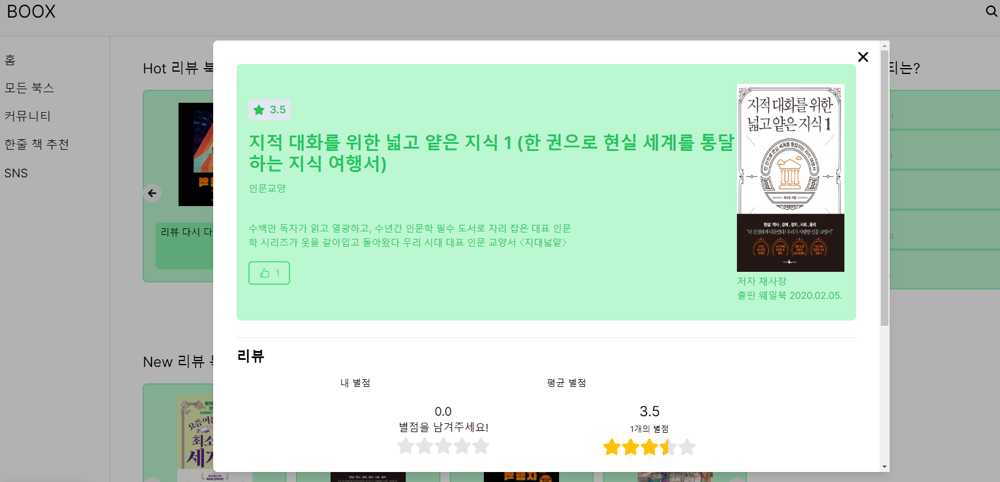

# BOOX(책 리뷰 및 커뮤니티 사이트)

## 📌 Summary

**책에 대해 소통하고 싶은 사람들을 위한 리뷰 및 커뮤니티 웹사이트**입니다. 블로그의 책 리뷰는 한 사람만의 의견이고 책 ott 서비스를 이용하지 않는 사람은 원하는 책의 리뷰를 보기 어렵기 때문에 이 사이트를 만들었습니다.  
빠른 렌더링 속도와 SEO 최적화를 위해 Next.js를 사용했습니다. Tailwind를 사용해 스타일링을 빠르게 적용할 수 있었고 framer-motion을 통해 interactive함을 더했습니다. RESTful한 API를 만드는 데에 초첨을 맞췄습니다. 인증에는 passport와 jwt를 사용했고 accessToken과 refreshToken을 따로 발급해 보안성을 높였습니다.

##### **주요 기능**

- 원하는 책에 대한 사람들의 리뷰를 보고, 리뷰를 남길 수 있음.
- 커뮤니티에서 카테고리에 따라 사람들과 소통
- 커뮤니티에서 원하는 유저를 팔로우 해 일주일 간 해당 유저의 활동을 SNS처럼 볼 수 있음.
- 한줄 책 추천을 통해 심플하게 책을 추천 받을 수 있음.
- 프로필에서 자신의 활동 한 눈에 보기

## 🔍 Info

- ###### 1인 개발
- ###### 프로젝트 이름: BOOX
- ###### 개발 기간: 2024.05 ~ 2024.06

<div style="display: flex; justify-content: center;">
  <figure style="display: flex; flex-direction: column; align-items:center; width: 50%;">
    <figcaption>홈화면</figcaption>
    
  </figure>
  <figure style="display: flex; flex-direction: column; align-items:center; width: 50%;">
    <figcaption>모달화면</figcaption>
    
  </figure>
</div>

## 💾 Background

웹사이트 제작의 전반적인 과정을 공부하고자 사이트 기획, 디자인, 구현, 배포를 혼자 진행한 프로젝트입니다. 처음 이 사이트를 기획하게 된 계기는 특정 책에 대한 사람들의 평가를 알고 싶지만 그럴만한 사이트를 쉽게 찾지 못했던 것입니다. 독서 ott를 사용하지 않는 사람은 책 구매 사이트나 블로그의 리뷰로 책의 정보를 얻는데 한 사이트에서 원하는 책의 모든 정보를 알 수 있으면 좋을 것 같아 제작하게 되었습니다.

Next.js는 App Router가 출시된 이후로 React 기반의 핵심 프레임워크로 자리잡았다 생각하여 직접 구현해보고자 사용했습니다. 서버는 RESTful한 API 구현 및 공부에 집중하기 위해 익숙한 js를 쓰고자 Node.js의 프레임워크인 Express.js를 사용했습니다. 기획 단계에서 모든 기능이나 데이터 모델을 정한 프로젝트가 아니어서 확장성이 좋고 mongoose를 통해 사용이 편리한 MongoDB를 DB로 정했습니다. 프론트엔드의 배포는 빠른 로딩 속도를위해 정적 파일들을 S3에 업로드하였고 지역 간의 로딩 차를 줄이고 효과적으로 요청을 라우팅하기 위해 cloudfront를 사용하였습니다. 비용적인 측면 뿐만 아니라 용량이나 성능 등을 제가 직접 조절하기 위해 백엔드의 배포는 EC2를 사용하였습니다.

## 🎯 Trouble Shooting

### 프론트엔드 빌드 시 발생한 정적 파일 생성 오류

##### 상황: next.js의 정적 파일을 s3에 업로드하기 위해 next.config.js에 output:"export" 설정을 한 후 빌드 시 발생한 오류

```
Error: Page "/books/[bookId]" is missing "generateStaticParams()" so it cannot be used with "output: export" config.
```

에러의 내용은 generateStaticParams()를 사용하지 않아서 발생한다고 한다.

#### 에러 해결을 위해 시도한 방법

##### 1. 기존 "use client"를 사용하는 page.tsx 파일을 index.tsx파일로 파일명을 바꾸고 해당 컴포넌트를 새로 만든 서버 컴포넌트인 page.tsx에서 공식문서를 보며 generateStaticParams()를 사용하여 정적파일을 생성하고 index.tsx 컴포넌트를 불러오기

> 해당 방법을 사용 시 오류가 발생하는 빌드 과정은 넘어가지만 공식문서를 보며 적용한 getStaticPaths와 getStaticProps를 사용하는 과정에서 App Router에서는 getStaticProps를 사용하지 않는다고 오류가 발생. getStaticProps를 지우면 getStaticPaths나 generateStaticParams에서 맞물리는 오류가 발생해 해결하려고 시도했지만 정보가 많지 않아 다른 방법을 시도했다.

##### 2. stackOverFlow에서 next.js 13.4.13 버전에서는 해당 오류가 발생하지 않고 정상적으로 동작한다는 정보 발견 후 적용

> 해당 방법으로 Next.js 버전을 다운그레이드 후 빌드 시 정상적으로 빌드가 완료되고 정적 파일이 생성되지만 배포된 사이트의 동적 라우팅을 사용한 페이지 방문 시 404 오류가 발생. 정적 파일이 정상적으로 생성되지 않은 것으로 판단하고 다른 방법을 찾아봄.

##### 3. next.js의 폴더명으로 자동 동적 라우팅을 사용하는게 아닌 query params를 이용하여 수동 동적 라우팅 적용

> Next.js의 공식 문서에도 해당 오류에 대한 내용이 없고 구글링에서 찾아본 내용에서도 더 시도할만한 방법이 없어 해당 방법으로 정적 파일을 생성했다. Next.js App Router의 자체적인 문제라는 글도 많아 해당 방법으로 처리한 상태

## 🛠 Technology Stacks

- Frontend: Next.js, recoil, react-query, tailwind, framer-motion
- Backend: Node.js, Express.js, passport, jwt
- DB: MongoDB, mongoose
- Deployment: S3, cloudfront, EC2

## 💡 Getting Started

#### Frontend

```bash
#Install Frontend Package & Run the Frontend server
$cd client
$npm install
$npm run dev
```

#### Backend

```bash
#Install Backend Package & Run the Backend server
$cd server
$npm install
$npm start
```

## ✔ Review

###### 프론트엔드 개발자는 무작정 신기술을 따라가야 한다고 생각하지 않습니다. 하지만 새로운 기술들은 무언가를 해결하기 위해 나온 것이고 장단점이 있기 때문에 그 장점이 단점보다 크고 자신의 프로젝트 개발에 도움이 된다면 신기술을 도입하는 것이 좋다고 생각합니다. 이번 프로젝트에서 Next.js와 Tailwind를 사용하면서 앞서 말한 점들을 많이 느꼈습니다. Next.js는 유의미한 로딩 속도 차이를 보였고 Tailwind는 클래스들에 익숙해졌을 때 디자인 속도가 확실히 빨라졌습니다. 하지만 Styled-component와 Tailwind를 둘 다 사용해본 결과 디자인 속도 차이로 발생하는 이득보다 Tailwind의 클래스가 많아질수록 가독성 저하, Styled-component의 네이밍이 주는 코드 가독성 향상이 더 효과적이라 생각했습니다. 이러한 부분들을 인지하고 필요한 새로운 기술들을 배우며 개발의 전문가가 되고 싶습니다.
